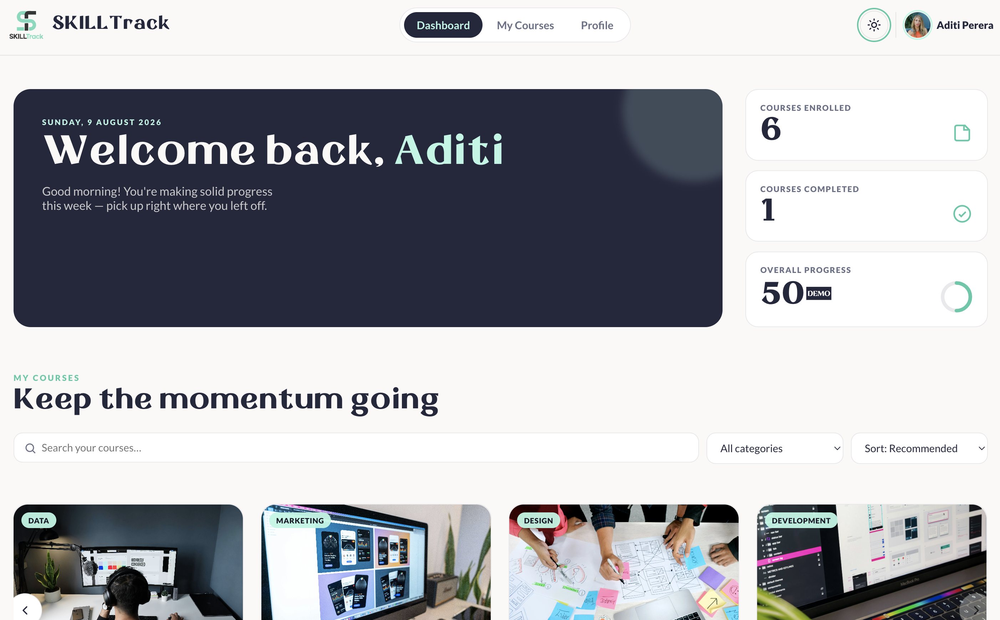
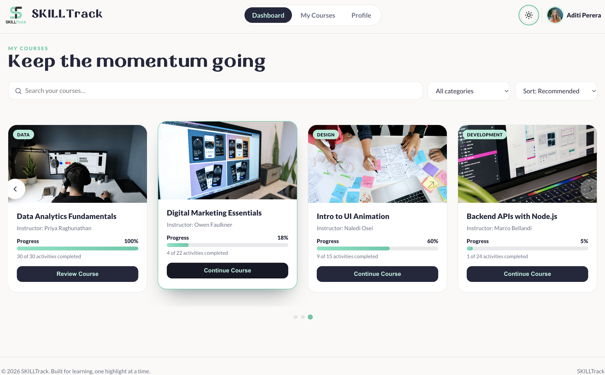
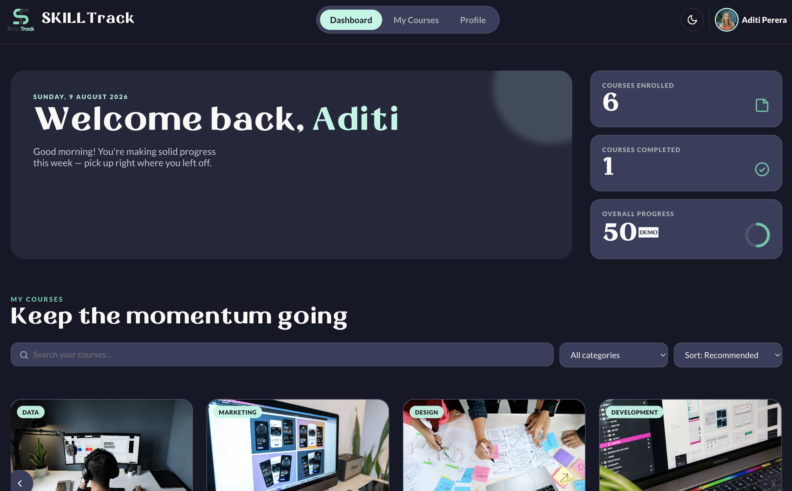
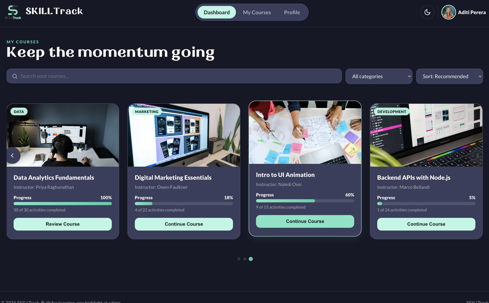
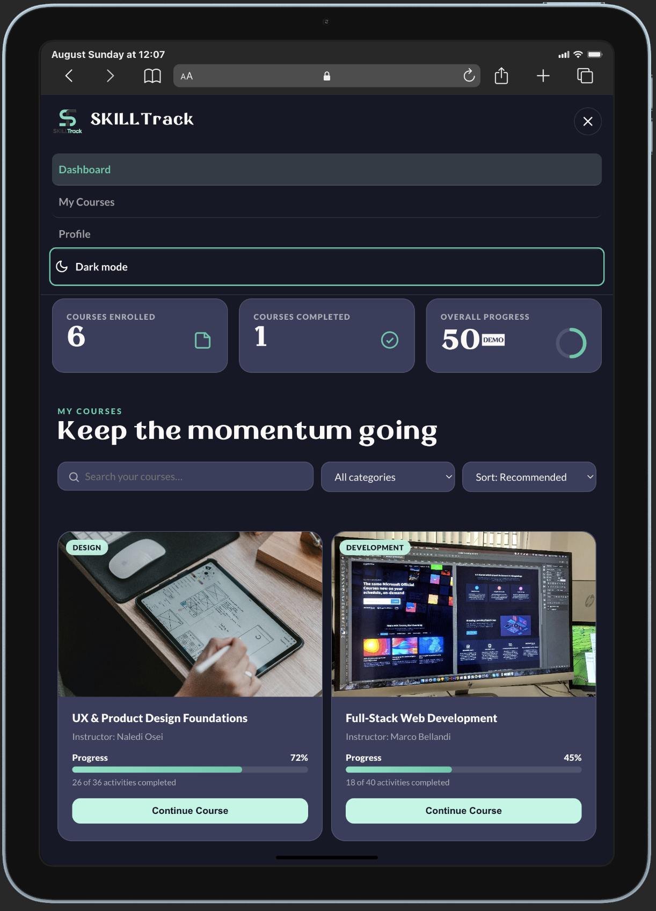
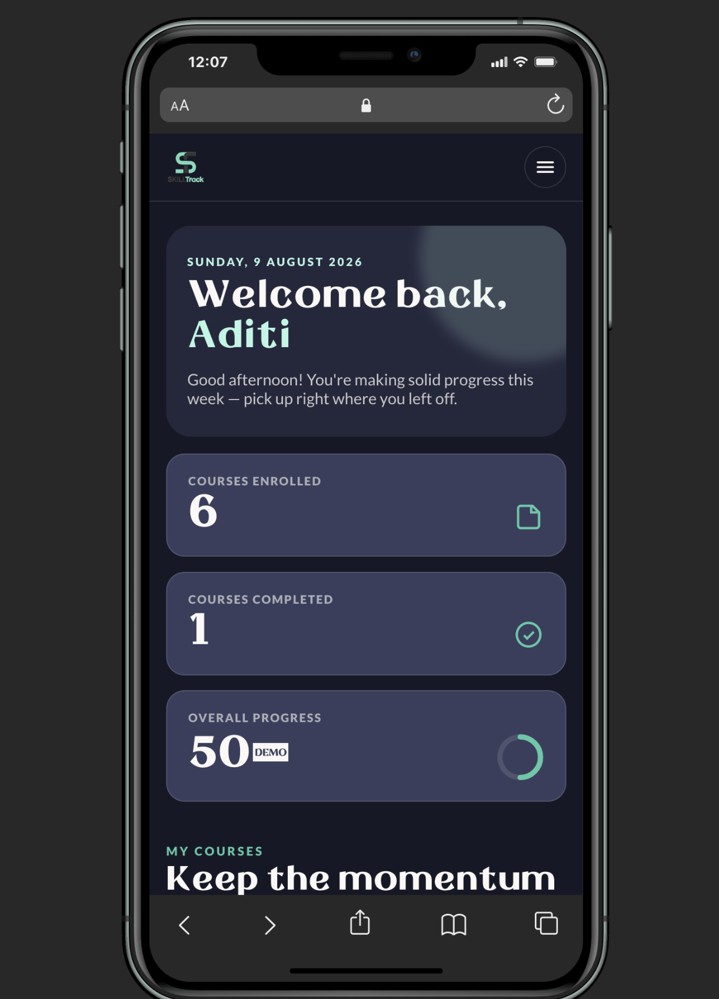

# SKILLTrack - LMS Course Dashboard

A clean, responsive, and interactive Learning Management System (LMS) Course Dashboard built using pure HTML, CSS, and Vanilla JavaScript.

## Technologies Used
* **HTML5:** Semantic markup & accessibility tags
* **CSS3:** Custom properties (CSS variables), Grid/Flexbox layouts & smooth animations
* **JavaScript (ES6+):** Vanilla JS for DOM manipulation, dynamic filtering, carousel logic & state management

## Key Features
* **Responsive Navigation:** Fixed navbar with mobile drawer menu.
* **Welcome Banner:** Dynamic greeting & circular progress ring indicator.
* **Interactive Carousel:** Custom swipeable/draggable multi-card course slider.
* **Search, Filter & Sort:** Real-time search by title/instructor, filter by category, and sort by progress or name.
* **Dark Mode (Bonus):** Dynamic theme switcher with `localStorage` persistence.
* **Course Modal (Bonus):** Interactive pop-up dialog showing detailed course info.
* **Fully Responsive:** Smooth view layout across Mobile, Tablet, and Desktop screens.

## How to Run
* Download or clone this repository.
* Open index.html in any web browser (or use VS Code Live Server).

## screenshots 

